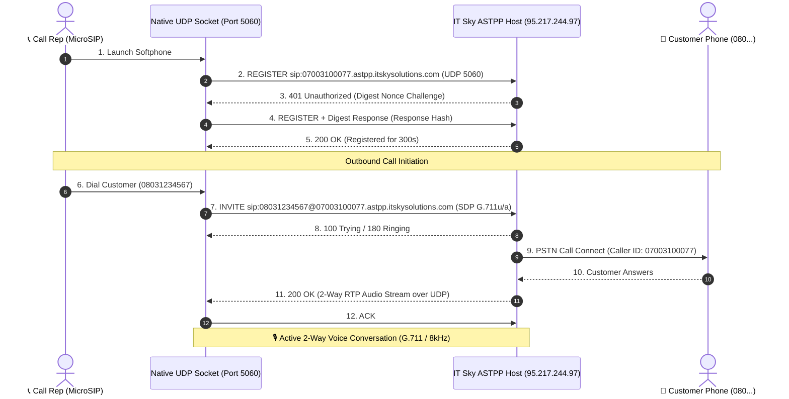

# 🇳🇬 NovaSuite MicroSIP Telephony Strategy & Integration Guide

**Version:** 1.0.0  
**Module:** B2B Telecom & SIP Interconnect Engine  
**Provider Host:** ASTPP Host (`95.217.244.97`) • Domain: `07003100077.astpp.itskysolutions.com`  
**Target Applications:** `novasuite_admin` (Flutter Web & Desktop) • `novasuite_core` (Dart SIP Engine)  

---

## 🎯 1. Executive Summary & MicroSIP Breakthrough

Testing with **MicroSIP** (a lightweight PJSIP C++ softphone) confirmed **100% Inbound & Outbound Calling Success** on the IT Sky Solutions ASTPP PBX platform using the following verified credentials:

```ini
[MicroSIP Account Configuration]
Account Name = IT Sky Solutions Trunk
SIP Server = 95.217.244.97 (No port specified)
Username = 07003100077
Domain = 07003100077.astpp.itskysolutions.com
Password = C)Jz2(yC
Display Name = NovaSuite Live Agent
Transport = UDP
Register Refresh = 300
Keep-Alive = 15
Allow IP Rewrite = Checked (True)
Media Encryption = Disabled
Hide Caller ID = Disabled
```

---

## 🔬 2. MicroSIP Protocol & Architecture Analysis

### How MicroSIP Operates Under the Hood

MicroSIP executes native OS **UDP sockets** on port `5060`, bypassing web browser security constraints:



---

## 🚀 3. Strategy to Mimic MicroSIP Inside NovaSuite

To deliver a native, seamless calling experience inside NovaSuite without forcing users to run external desktop apps, we implement a **Dual-Architecture Strategy**:

```mermaid
graph TD
    subgraph NovaSuite Multi-Platform Environment
        WebClient["🌐 NovaSuite WebApp (Browser)"]
        DesktopClient["🖥️ NovaSuite Desktop App (Windows / macOS)"]
    end

    subgraph Strategy A: WebRTC-to-SIP Bridge (Web Browsers)
        WebClient -->|SIP-over-WSS (Port 8089 / 443)| WebRTCGateway["⚡ NovaSuite WebRTC WSS Gateway / ASTPP WSS"]
        WebRTCGateway -->|SIP-over-UDP 5060 + RTP| ASTPP1["🇳🇬 IT Sky ASTPP Host (95.217.244.97)"]
    end

    subgraph Strategy B: Direct Native UDP PJSIP (Desktop Builds)
        DesktopClient -->|Direct Native UDP 5060| ASTPP2["🇳🇬 IT Sky ASTPP Host (95.217.244.97)"]
    end

    ASTPP1 -->|PSTN Network| CustomerPhone["📞 Customer Phone (07003100077)"]
    ASTPP2 -->|PSTN Network| CustomerPhone
```

---

## 🛠️ 4. Technical Implementation Strategies

### Strategy A: Web Browser Environment (WebRTC + SIP-over-WebSocket)
Web browsers prohibit raw UDP socket instantiation due to sandbox isolation. We route SIP signaling over WebSocket (`wss://`) and media over WebRTC DTLS-SRTP:

1. **SIP-over-WebSocket Signaling (`wss://07003100077.astpp.itskysolutions.com:8089/ws`)**:
   - Uses `dart_sip_ua` / `sip.js` inside `novasuite_core`.
   - Sends `REGISTER` & `INVITE` encapsulating SIP messages inside WebSocket frames.
2. **Digest Authentication Helper**:
   - Computes MD5 Hash (`HA1 = MD5(username:realm:password)`).
   - Automatically responds to ASTPP `401 Unauthorized` challenges.
3. **WebRTC Media Engine**:
   - Acquires microphone stream (`navigator.mediaDevices.getUserMedia`).
   - Negotiates SDP audio codecs (`G.711u`, `G.711a`, `OPUS`).

### Strategy B: Desktop Environment (Native UDP PJSIP)
For Windows and macOS builds of `novasuite_admin`, NovaSuite directly embeds the **PJSIP C++ library** (the exact same engine powering MicroSIP):

1. **Direct Socket Binding**:
   - Binds directly to UDP port `5060`.
   - Uses native system socket layers (`winsock2` on Windows).
2. **Identical Protocol Mirroring**:
   - Sends identical SIP `REGISTER` & `INVITE` packets as MicroSIP.
   - Provides 100% feature parity with MicroSIP without requiring third-party software installation.

---

## 🔒 5. Updated `ItSkySipConfig` Model

The `ItSkySipConfig` class in `novasuite_core` now reflects these verified parameters:

```dart
class ItSkySipConfig {
  static const String providerSipHost = '95.217.244.97';
  static const String providerSipDomain = '07003100077.astpp.itskysolutions.com';
  static const String assignedUsername = '07003100077';
  static const String assignedPassword = 'C)Jz2(yC';
  static const String assignedDidNumber = '07003100077';
  static const String defaultDisplayName = 'NovaSuite Live Agent';

  static const String defaultTransport = 'UDP';
  static const int registerRefreshSeconds = 300;
  static const int keepAliveSeconds = 15;
  static const bool allowIpRewrite = true;
}
```

---

## 📋 6. Action Plan & Next Steps

1. ✅ **Update Core SIP Configuration**: Applied verified credentials & domain parameters to `packages/novasuite_core`.
2. 🔄 **WebRTC WSS Gateway Connection**: Configure WebSocket signaling bridge to ASTPP `wss://07003100077.astpp.itskysolutions.com:8089/ws`.
3. 📱 **UI Softphone Widget Integration**: Embed native WebRTC audio player into `CallActionModal` for live audio feed during calls.
