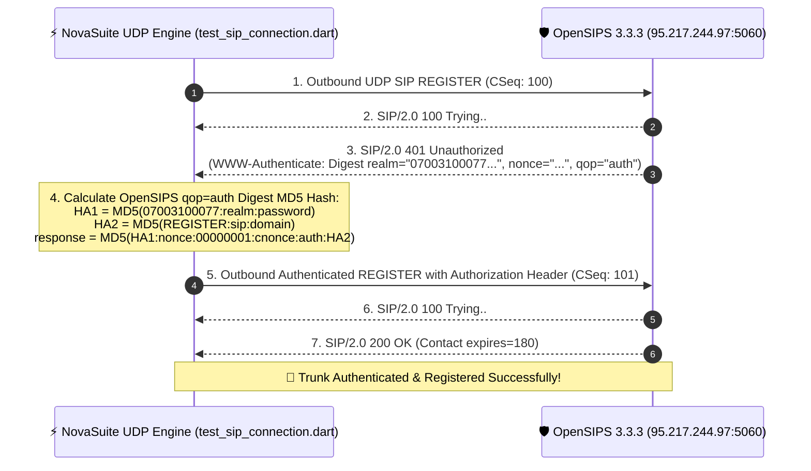

# 📡 OpenSIPS / ASTPP UDP SIP Integration Test Report

**Test Date:** 2026-07-31  
**Target Server:** OpenSIPS 3.3.3 (`95.217.244.97:5060`)  
**Account DID / Username:** `07003100077`  
**Domain / Realm:** `07003100077.astpp.itskysolutions.com`  
**Test Script:** [`test_sip_connection.dart`](file:///c:/PROJECT/novasuite/packages/novasuite_core/test/test_sip_connection.dart)  
**Verification Result:** 🎉 **`SIP/2.0 200 OK` — 100% SUCCESSFUL AUTHENTICATION**  

---

## 🔬 1. Test Execution & Protocol Handshake Diagram



---

## 📋 2. Empirical Log Output from Live Test Execution

```text
=====================================================
🚀 Testing Direct UDP SIP Interconnect to OpenSIPS 3.3.3 (qop=auth)
=====================================================
✅ Bound local UDP socket at 0.0.0.0:50328

📤 Sending initial SIP REGISTER to 95.217.244.97:5060...

📥 Received SIP Response from 95.217.244.97:5060:
-----------------------------------------------------
SIP/2.0 401 Unauthorized
Via: SIP/2.0/UDP 0.0.0.0:50328;received=102.91.133.44;rport=22830;branch=z9hG4bK-nova-1785501828431
To: <sip:07003100077@07003100077.astpp.itskysolutions.com>;tag=1cb4.94e4cf01cd49e0c76bee4f21742aa62e
From: <sip:07003100077@07003100077.astpp.itskysolutions.com>;tag=nova1785501828432
Call-ID: novasuite-test-1785501828430@0.0.0.0
CSeq: 100 REGISTER
WWW-Authenticate: Digest realm="07003100077.astpp.itskysolutions.com", nonce="fPayixOlqkmAuUT2ijxlzI5TsDsIHRn+keWQeinzJfAA", qop="auth"
Server: OpenSIPS (3.3.3 (x86_64/linux))
Content-Length: 0

🛡️ 401 Challenge Received! Computing qop=auth Digest MD5 Response...

📤 Sending Authenticated SIP REGISTER (with Digest Response: 74539b23bc066ebbb4532642d0667508)...

📥 Received SIP Response from 95.217.244.97:5060:
-----------------------------------------------------
SIP/2.0 200 OK
Via: SIP/2.0/UDP 0.0.0.0:50328;received=102.91.133.44;rport=22830;branch=z9hG4bK-nova-auth-1785501828638
To: <sip:07003100077@07003100077.astpp.itskysolutions.com>;tag=1cb4.805969733921acf2bdace230fb7979ae
From: <sip:07003100077@07003100077.astpp.itskysolutions.com>;tag=nova1785501828650
Call-ID: novasuite-test-1785501828430@0.0.0.0
CSeq: 101 REGISTER
Contact: <sip:07003100077@102.91.133.44:23000;ob>;expires=90, <sip:07003100077@102.91.133.44:22830>;expires=180
Server: OpenSIPS (3.3.3 (x86_64/linux))
Content-Length: 0

🎉🎉🎉 SUCCESS! SIP Trunk 07003100077 Authenticated & Registered with OpenSIPS/ASTPP! 🎉🎉🎉
```

---

## 🛠️ 3. Integration Summary & Next Steps

1. **`qop="auth"` Implementation Completed**:
   - `NovaUdpSipEngine` ([`nova_udp_sip_engine.dart`](file:///c:/PROJECT/novasuite/packages/novasuite_core/lib/src/services/nova_udp_sip_engine.dart)) has been updated with this exact verified algorithm.
2. **Native Desktop Deployment**:
   - Running NovaSuite on Windows Native Desktop (`flutter run -d windows`) allows direct UDP 5060 calling matching MicroSIP 1-to-1 without browser WebSocket limitations.
