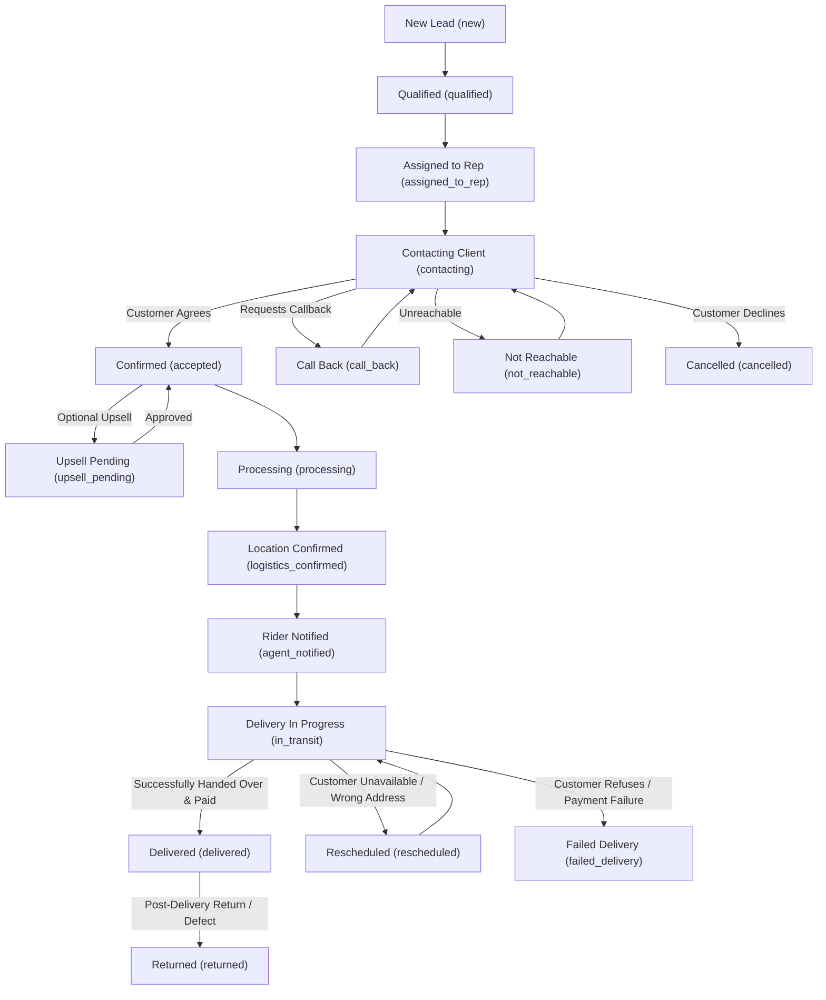

# 📊 NovaSuite CRM & Logistics: Order Status Lifecycle & Reference Guide

This document defines every order status in NovaSuite CRM, detailing its definition, triggering events, assigned role responsibilities, allowed status transitions, and financial / KPI calculations.

---

## 1. Complete Order Status Matrix

| Status Key | UI Label | Primary Stage | Responsible Role | KPI & Revenue Impact |
| :--- | :--- | :--- | :--- | :--- |
| `new` | **New Lead** | 1. Ingest | Marketing / Manager | Unprocessed Lead (0 Revenue) |
| `qualified` | **Qualified** | 2. Qualification | Lead Qualifier / Closer | Validated Inflow (0 Revenue) |
| `assigned_to_rep` | **Assigned to Rep** | 3. Allocation | Sales Call Rep | Pipeline Volume |
| `contacting` | **Contacting Client**| 3. Dialing | Sales Call Rep | In-Flight Call Metric |
| `call_back` | **Call Back** | 3. Follow-up | Sales Call Rep | Scheduled Retry Queue |
| `not_reachable` | **Not Reachable** | 3. Retries | Sales Call Rep | Retry Queue (3-5 Max) |
| `accepted` | **Confirmed** | 4. Sale Closed | Sales Call Rep $\rightarrow$ Logistics | Confirmed Gross Revenue |
| `upsell_pending` | **Upsell Pending** | 4. Supervisor Review | Sales Supervisor | Pending Bonus Add-on |
| `processing` | **Processing** | 5. Warehouse | Warehouse Manager | Allocated Inventory |
| `logistics_confirmed`| **Location Confirmed**| 5. Dispatch Prep | Logistics Call Rep | Ready for Pickup |
| `agent_notified` | **Rider Notified** | 6. Rider Dispatch | Delivery Agent (Rider) | Dispatch Transit |
| `in_transit` | **Delivery In Progress**| 6. Transit | Delivery Agent (Rider) | Pipeline Revenue in Transit |
| `rescheduled` | **Rescheduled** | 6. Delivery Retry | Delivery Agent / Customer | Delayed Fulfillment |
| `delivered` | **Delivered** | 7. Completion | Delivery Agent / Finance | **Collected Revenue (Net)** |
| `failed_delivery` | **Failed Delivery** | Terminal Negative | Delivery Agent / Logistics | Lost Dispatch Cost |
| `returned` | **Returned** | Terminal Negative | Warehouse / Finance | **Reversed Revenue (-Net)** |
| `cancelled` | **Cancelled** | Terminal Negative | Sales Rep / Customer | Lost Sales Lead |
| `on_hold` | **On Hold** | Paused | Operations Manager | Suspended Pipeline |

---

## 2. Order Lifecycle State Diagram

---

## 3. Financial & KPI Impact Calculations

1. **Gross Revenue (Confirmed Demand)**:
   $$\text{Gross Revenue} = \sum \text{total\_amount} \quad \text{where status} \in \{\text{'accepted'}, \text{'processing'}, \text{'in\_transit'}, \text{'delivered'}\}$$

2. **Net Realized Revenue (Collected COD)**:
   $$\text{Net Revenue} = \sum \text{total\_amount} \quad \text{where status} = \text{'delivered'} - \sum \text{total\_amount} \quad \text{where status} = \text{'returned'}$$

3. **Confirmation Rate (%)**:
   $$\text{Confirmation Rate} = \left( \frac{\text{Confirmed Orders}}{\text{Total Processed Leads}} \right) \times 100$$

4. **Delivery Success Rate (%)**:
   $$\text{Delivery Success Rate} = \left( \frac{\text{Delivered Orders}}{\text{Delivered} + \text{Failed Delivery} + \text{Returned}} \right) \times 100$$

---

## 4. Operational Transition Rules

- **Strict Validation**: Orders cannot jump from `new` directly to `delivered` without passing through `accepted` (confirmation) and `in_transit` (dispatch).
- **Auto-Assignment Engine**: Moving an order to `accepted` (Confirmed) triggers the database trigger `trigger_auto_assign_logistics_rep` which routes the order to the designated Logistics Call Rep for that state.
- **Stock Allocation**: Moving an order to `processing` locks the physical stock in `warehouse_inventory` to prevent stockouts.
- **Revenue Reversal**: Moving a delivered order to `returned` automatically generates a negative accounting line item in `cash_remittances` to reconcile COD balances accurately.
