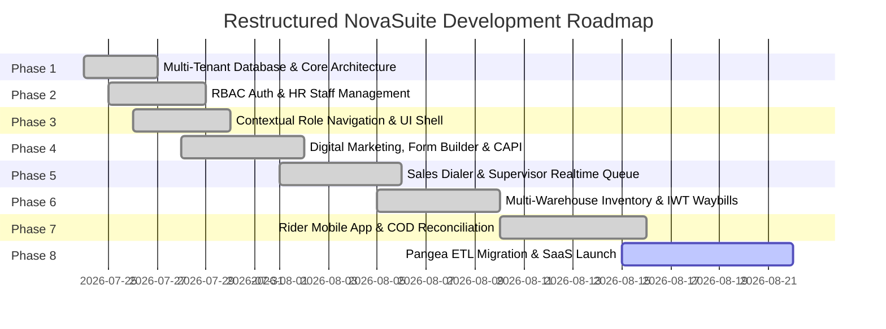

# NovaSuite CRM & NovaExpress Logistics - Restructured Development Roadmap & Milestones

**Version:** 2.0.0  
**Project:** NovaSuite White-Label ERP, CRM & Logistics Suite  
**Target Infrastructure:** Flutter Monorepo + Supabase (PostgreSQL, Row Level Security, Edge Functions, Realtime, Storage)  

---

## 🗺️ Master Project Roadmap & Architectural Alignment

---

## 📋 Comprehensive Phase-by-Phase Deliverables

### ✅ Phase 1: Multi-Tenant Architecture & Database Foundation (COMPLETED)
- [x] **PostgreSQL Schema Initialization**: Multi-tenant database schema (`supabase/migrations/20260724000000_init_novasuite_schema.sql`) with 100% idempotent statements (`CREATE TABLE IF NOT EXISTS`).
- [x] **Row Level Security (RLS)**: Enforced tenant data isolation across all tables via `company_id = current_company_id()`.
- [x] **Supabase Realtime Replication**: Automated publication configuration for `orders`, `cash_remittances`, and `stock_transfers`.
- [x] **Atomic Round-Robin Order Assignment**: PL/pgSQL function `assign_order_round_robin()` with `FOR UPDATE` row locks to prevent duplicate assignments during high-scale order bursts.
- [x] **Serverless Webhook Edge Function**: Edge Function (`/functions/v1/submit-order`) to ingest landing page leads, execute round-robin assignment, and trigger Meta Conversions API (CAPI) events.
- [x] **Core Monorepo Scaffolding**: Modular packages `novasuite_core`, `novasuite_admin`, and `novaexpress_rider`.

---

### ✅ Phase 2: Authentication, RBAC & HR Staff Management (COMPLETED)
- [x] **Real Supabase Auth Integration**: Connected `AuthRepository` in `packages/novasuite_core` to `https://oygtaeriljuelhshfvkv.supabase.co`.
- [x] **System Role Hierarchy (9 Roles)**:
  1. `super_admin`: Platform SaaS Administrator.
  2. `agm`: Assistant General Manager.
  3. `hr_manager`: HR Manager (Staff Onboarding & Supervisor Delegation).
  4. `supervisor`: Sales Department Supervisor.
  5. `sales_call_rep`: Sales Call Rep.
  6. `logistics_call_rep`: Logistics Call Rep.
  7. `digital_marketer`: Digital Marketer.
  8. `delivery_agent`: Delivery Agent / Rider.
  9. `finance_manager`: Finance Manager.
- [x] **HR Department Staff Directory**: Built `HRStaffManagementPage` featuring staff table, role filters, active/suspended status toggles, and staff headcount metrics.
- [x] **Onboarding & Supervisor Delegation Modal**: Built `AddEditStaffDialog` allowing HR Managers to onboard employees, assign system roles, and delegate direct supervisors (`supervisor_id`).

---

### ✅ Phase 3: Role-Contextual Navigation & UI Shell (COMPLETED)
- [x] **Strict Contextual Navigation Sidebar**: Filtered `AdminMainShell` sidebar menu items so each user role **only** sees their authorized operational tabs:
  - **Digital Marketer**: Campaigns, Lead Forms, Form Builder, Submissions, CAPI Setup.
  - **Sales Call Rep**: My Assigned Call Queue, Customer Dialer.
  - **Supervisor**: Realtime Approval Queue, Sales Team Queue, Department Analytics.
  - **Logistics Call Rep**: Address Verification Queue, Rider Dispatch, Multi-Warehouse Matrix, IWT Waybills.
  - **Finance Manager**: COD Cash Holding Overview, Deposit Receipt Verification, Agency Settlements.
  - **HR Manager**: HR Staff Directory, Onboard Employee, Supervisor Delegation.
  - **AGM / Super Admin**: Complete Executive Business Overview, Marketer Budget Allocations, Sub-Company Whitelabeling.
- [x] **Department-Specific KPI Headers**: Dynamically customized metric headers based on `widget.currentUser.role`.

---

### ✅ Phase 4: Digital Marketing, Pangea Form Builder & FB CAPI (COMPLETED)
- [x] **Pangea CRM Ad Performance Dashboard**: Built `DigitalMarketingSuitePage` featuring:
  - Metric Cards: `SPEND` ($ Ad spend), `GENERATED` (Lead count), `DELIVERED` (Revenue & 4.24x ROAS multiplier).
  - Time Range Filters: `Today` | `Week` | `Month` | `Quarter`.
  - Daily Spend Trend Chart & Top Campaigns Table.
- [x] **Campaign Form Builder (3-Step Wizard)**: Built `CampaignFormBuilderPage`:
  - **Step 1 (Basics)**: Form Title, Marketer Email, Thank You Redirect URL (`detoxwithnova.xyz/thank-you`), Success Message, Submit Button Text, Quantity Mode, Preset Country.
  - **Step 2 (Builder & Styling)**: Field visibility/required switches, live color pickers, font selector, and live preview box.
  - **Step 3 (Upsell & HTML)**: 1-Click checkout upsell offers + Standalone Copy-Paste HTML snippet.
- [x] **Meta CAPI & Pixel Setup**: Integrated Webhook URL generator and CAPI credentials manager.

---

### ✅ Phase 5: Sales Dialer Queue & Supervisor Approval Engine (COMPLETED)
- [x] **Sales Rep Call Queue**: Interactive table displaying auto-assigned leads with click-to-dial links and customer address details.
- [x] **Up-Sell & Down-Sell Request Engine**: Built `RequestUpsellDialog` calculating base prices, extra promotional items, discounts, and customer notes.
- [x] **Supervisor Realtime Approval Queue**: Live visual badge counter & 1-click Approve/Reject action handlers automatically updating total order amounts and moving approved orders to the logistics queue.

---

### ✅ Phase 6: Multi-Warehouse Inventory & Inter-Warehouse Stock Transfers (COMPLETED)
- [x] **Multi-Warehouse Stock Matrix**: Nationwide inventory tracking across Central Factory Hubs, Agency Regional Hubs, and Independent Rider Mini-Hubs (car trunk stock).
- [x] **Inter-Warehouse Transfer (IWT) Dispatch Engine**: Built `CreateTransferDialog` for logistics managers to generate Waybills (`WB-2026-XXXX`) and dispatch stock.
- [x] **Stock Transfer Receipt & Restock**: Live Waybills table with 1-click **Confirm Receipt** action handlers updating destination warehouse stock balances.

---

### ✅ Phase 7: Rider Mobile App & Cash-on-Delivery (COD) Reconciliation (COMPLETED)
- [x] **Rider Mobile Application (`novaexpress_rider`)**: Native Flutter mobile app with Active Jobs feed, Mini-Hub stock meter, and POD signature/photo capture.
- [x] **Rider Bank Deposit Upload**: Built deposit upload dialog for riders to submit cash deposit receipts.
- [x] **Finance Remittance Verification Engine**: Built `VerifyRemittanceDialog` in `novasuite_admin` allowing Finance Managers to verify bank receipts and clear rider cash holding balances.
- [x] **Automated COD Credit Limit Threshold**: Credit limit meter (₦150,000 max limit) protecting business cashflow.

### ✅ Phase 8: WebRTC Softphone, IT Sky SIP Interconnect & B2B Telecom Reseller Engine (COMPLETED)
- [x] **NovaDialer WebRTC Floating Softphone Widget**: Created `NovaDialerFloatingBar` featuring live call timer, mute/hold/speaker controls, manual dialpad, and real-time SIP registration status.
- [x] **Interactive Active Call Console & Sales Pitch Scripts**: Product-matching sales pitch scripts, interactive objection handling chips (`Price Objection`, `COD Inspection`, `Dosage`, `Delivery Time`) with live verbal rebuttals, and 1-tap upsell/status trigger.
- [x] **IT Sky Solutions SIP Trunk Interconnect (`196.13.112.196:5060`)**: Physical POI interconnect in Abuja supporting 100Mbps bi-directional capacity (`G711alaw`, `0209360XXXX`, `070031XXXXX`).
- [x] **B2B Company Telecom Call Wallet (`company_call_wallets`)**: Supabase tables (`company_call_wallets`, `company_call_transactions`, `call_logs`) enabling tenant companies to top up call balance via Paystack/Flutterwave presets (`₦25k`, `₦50k`, `₦100k`, `₦250k`).
- [x] **Metered Call Rate & NovaSuite ₦1.00/min Margin Engine**: Automated per-second call deductions charging tenants **₦14.75 / min** (vs. ₦13.75 / min IT Sky wholesale rate), generating **+₦1.00 / min net passive margin** for NovaSuite.
- [x] **Mobile-Responsive Paginated Call Queue DataTable**: Super-organized call queue displaying 3 adaptive columns on mobile (<800px) with 1-touch dial actions and pagination controls.

---

### 📦 Phase 9: Legacy Pangea Suite ETL Migration & SaaS Launch (NEXT UP)
- [ ] **Pangea Suite ETL Migration Script**: SQL migration ([`supabase/migrations/20260725000000_pangea_etl_migration.sql`](file:///c:/PROJECT/novasuite/supabase/migrations/20260725000000_pangea_etl_migration.sql)) to import legacy Pangea Suite CSV data (*Customers, Products, Historical Orders, Reps, Marketers*) into NovaSuite multi-tenant schema.
- [ ] **B2B SaaS Tenant Management & Billing**: Super Admin portal interface to onboard new external client companies, assign subscription tiers (*Starter*, *Pro*, *Enterprise*), and toggle module feature flags.
- [ ] **High-Volume Load & Stress Testing**: Automated load simulation script firing 1,000+ concurrent order submissions to verify zero duplicate round-robin assignments under heavy load.
