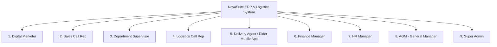

# NovaSuite CRM & NovaExpress Logistics - Role-Based Navigation & Workflow Matrix

**Version:** 1.0.0  
**Project:** NovaSuite White-Label CRM & NovaExpress Logistics Suite  
**Target Platform:** Web, Windows, macOS, iOS, Android  
**Backend Infrastructure:** Supabase (PostgreSQL, Row Level Security, Edge Functions, Realtime, Storage)  

---

## 🗺️ System Navigation Architecture Overview

---

## 📋 Role-by-Role Navigation & Operational Workflows

### 1️⃣ Digital Marketer (`digital_marketer`)
> **Core Objective:** Create product ad campaigns, build landing page checkout forms, track spend/ROAS analytics, and configure server-side conversion webhooks.

| Tab Name | Purpose & Interface Workflow | Key Actions & Operational Triggers |
| :--- | :--- | :--- |
| **1. Ad Performance Dashboard** | High-level performance dashboard showing spend vs. conversion return. Filterable by `Today`, `Week`, `Month`, `Quarter`. | • View **SPEND** ($ Ad spend), **GENERATED LEADS** (Total lead forms submitted), and **DELIVERED REVENUE** (Realized cash revenue). • View **ROAS Multiplier** ($\text{Delivered Revenue} / \text{Ad Spend}$). • Monitor **Daily Spend Trend Chart** across Meta, TikTok, and Google. |
| **2. Campaign Lead Forms** | List of all active checkout forms created for landing pages. | • View form title, linked product, target Thank You Redirect URL, and total lead count. • Click **Copy HTML Embed Code** to paste snippet into WordPress/Elementor. • Click **Edit Form** to modify fields or colors. |
| **3. Campaign Form Builder** | Interactive 3-Step Wizard to build custom checkout forms. | • **Step 1 (Basics)**: Set Form Title, Marketer Email, Thank You Redirect URL, Success Message, Quantity Mode (`Number`, `Dropdown`, `Radio`), Preset Country. • **Step 2 (Builder & Styling)**: Toggle field visibility & required state (*Full Name*, *Email*, *Phone*, *State*, *Address*), pick button/card colors, select font family, and view live preview. • **Step 3 (Upsell & HTML)**: Configure 1-click checkout upsell offers & copy standalone HTML/JS code. |
| **4. Submissions Tracker** | Real-time log of customer leads submitted through landing pages. | • View incoming leads with customer name, phone number, delivery state, product, campaign tag, and timestamp. • Filter leads by campaign or date range. |
| **5. SMS & WhatsApp Broadcasts** | Customer re-engagement messaging tool. | • Select target customer segment (*All Customers*, *Delivered Orders*, *Abandoned Leads*). • Compose promotional SMS/WhatsApp message and trigger mass broadcast. |
| **6. FB CAPI & Pixel Setup** | Server-side conversion tracking configuration. | • Copy CAPI Webhook Endpoint URL (`.../functions/v1/submit-order`). • Configure Meta Pixel ID and CAPI Access Token to automatically send purchase events with SHA-256 hashed customer phone/name. |

---

### 2️⃣ Sales Call Rep (`sales_call_rep`)
> **Core Objective:** Call leads assigned via atomic round-robin, confirm delivery addresses, pitch promotional up-sells/down-sells, and update order status.

| Tab Name | Purpose & Interface Workflow | Key Actions & Operational Triggers |
| :--- | :--- | :--- |
| **1. My Call Queue** | Personal dialer queue showing leads auto-assigned to the rep. | • View assigned orders with customer name, phone, city/state, base price, and order status. • Click-to-dial customer phone number. • Filter by status (`new`, `assigned_to_rep`, `contacting`, `accepted`, `on_hold`). |
| **2. Customer Dialer & Script** | Active call interface with built-in sales scripts. | • View customer order details, delivery address, and product FAQs. • Select outcome: `Customer Accepted`, `Rescheduled / On-Hold`, or `Cancelled`. • Submit order for logistics dispatch. |
| **3. Request Up-Sell / Down-Sell** | Modal to pitch promotional add-ons or discounts. | • Select extra add-on item or down-sell discount. • Add customer notes (e.g. *"Client agreed to add 1 extra bottle for ₦12,000"*). • Submits order to Supervisor Realtime Approval Queue (`upsell_pending`). |
| **4. My Performance Stats** | Rep performance metrics dashboard. | • Track total calls made today, confirmation rate %, accepted orders total value, and personal commission earned. |

---

### 3️⃣ Department Supervisor (`supervisor`)
> **Core Objective:** Real-time authorization of sales rep upsells/downsells, call rep workload monitoring, and round-robin product rule configuration.

| Tab Name | Purpose & Interface Workflow | Key Actions & Operational Triggers |
| :--- | :--- | :--- |
| **1. Realtime Approval Queue** | Live push notification feed for pending upsells/downsells. | • View pending requests with Base Price, Requested Upsell Amount, and New Total Amount. • 1-Click **Approve Order**: Updates total price, sets `upsell_status = approved`, moves order to `accepted` for logistics. • 1-Click **Reject Upsell**: Reverts price to base total. |
| **2. Team Performance Matrix** | Live call rep leaderboard and workload monitor. | • View active call reps, current pending orders load per rep, total calls answered, and confirmation conversion rate. • Manually reassign orders between reps if a rep is unavailable. |
| **3. Round-Robin Product Rules** | Attach call reps to specific products for automated routing. | • Toggle rep active/inactive status in round-robin queue. • Attach or detach reps from specific product SKUs. |
| **4. Sales Department Analytics** | Department revenue and call metrics. | • High-level sales conversion trends, average order value (AOV), and top-performing sales reps. |

---

### 4️⃣ Logistics Call Rep (`logistics_call_rep`)
> **Core Objective:** Verify customer delivery addresses, dispatch orders to in-house NovaExpress riders or 3rd-party logistics agencies, and manage warehouse stock transfers.

| Tab Name | Purpose & Interface Workflow | Key Actions & Operational Triggers |
| :--- | :--- | :--- |
| **1. Address Verification Queue** | Orders in `accepted` status requiring logistics confirmation. | • Confirm customer availability, address landmarks, and preferred delivery time window. • Update status to `logistics_confirmed`. |
| **2. Rider & Agency Dispatch** | Assign orders to specific delivery agents or agencies based on coverage. | • Select delivery provider: *In-House NovaExpress*, *3rd-Party Agency* (e.g. Red Star, GIG), or *Independent Direct Rider*. • Assign order to specific Rider (e.g. *Rider Emeka*). • Triggers `agent_notified` push notification to Rider Mobile App. |
| **3. Warehouse Inventory Matrix** | Multi-warehouse stock tracking across the country. | • Monitor stock levels across **Central Factory Hubs**, **Agency Regional Hubs**, and **Rider Mini-Hubs** (car trunk inventory). • Track stock state breakdown (`available_stock`, `allocated_stock`, `in_transit_stock`). |
| **4. Inter-Warehouse Transfers (IWT)** | Generate stock dispatch Waybills between locations. | • Click **Dispatch Stock Transfer**: Generates Waybill `WB-2026-XXXX`, specifies origin warehouse, destination hub, product, and quantity. • Monitor Waybill status (`dispatched`, `in_transit`, `completed`). • Click **Confirm Receipt**: Restocks destination warehouse inventory. |

---

### 5️⃣ Delivery Agent / Rider Mobile App (`delivery_agent` / `novaexpress_rider`)
> **Core Objective:** Native mobile app for riders to accept delivery jobs, navigate to customers, collect Pay-on-Delivery (COD) cash, upload proof of delivery (POD), and upload bank deposit receipts.

| Tab / Screen Name | Purpose & Interface Workflow | Key Actions & Operational Triggers |
| :--- | :--- | :--- |
| **1. Active Jobs Feed** | List of assigned delivery orders in rider's coverage zone. | • View customer name, phone number, delivery address, COD cash amount to collect. • 1-Tap to call customer or open map navigation. • Accept or start delivery job (`in_transit`). |
| **2. Mini-Hub Stock Inventory** | Personal car trunk/motorcycle inventory meter. | • Track physical stock units currently held in rider's personal mini-hub. • View allocated units vs available units. |
| **3. COD Cash Holding Meter** | Real-time cash holding limit meter protecting cashflow. | • Display current unremitted cash collected (e.g. ₦125,000) vs Max Credit Threshold (₦150,000). • Alert rider when approaching credit limit to prevent job lockout. |
| **4. Proof of Delivery (POD) Modal** | Digital signature and photo capture upon delivery. | • Capture customer digital signature on screen. • Snap photo of delivered package. • Mark order as `delivered` and collect COD cash. |
| **5. Bank Deposit Receipt Upload** | Upload bank transfer teller/receipt to clear cash holding. | • Select bank transferred to, enter bank transaction reference string. • Upload photo/file of bank deposit receipt. • Submits remittance to Finance Manager for verification and resets rider cash balance. |

---

### 6️⃣ Finance Manager (`finance_manager`)
> **Core Objective:** Reconcile cash collected by delivery agents, verify bank deposit receipts, enforce rider credit limits, and settle 3rd-party agency payouts.

| Tab Name | Purpose & Interface Workflow | Key Actions & Operational Triggers |
| :--- | :--- | :--- |
| **1. COD Cash Holding Overview** | Monitor nationwide unremitted cash held by delivery agents. | • View real-time list of all riders, current cash holding balance, credit limit, and status. • Flag riders exceeding credit limit. |
| **2. Deposit Receipt Verification** | Verify uploaded rider bank deposit receipts. | • Review uploaded bank receipt photo and transaction reference. • Click **Verify Deposit**: Resets rider cash holding balance to ₦0 and updates remittance status to `verified`. • Click **Reject Deposit**: Notifies rider to re-upload valid bank proof. |
| **3. Agency Settlements & Payouts** | Commission calculation for 3rd-party logistics providers. | • Calculate total successful deliveries completed by external logistics agencies. • Generate settlement payout vouchers based on per-delivery commission rates. |
| **4. Financial Audit Reports** | Executive cashflow and audit ledger. | • Reconcile total COD cash collected vs total bank deposits vs outstanding cash in transit. |

---

### 7️⃣ HR Manager (`hr_manager`)
> **Core Objective:** Employee directory management, onboarding new staff, assigning system roles, and delegating direct supervisors.

| Tab Name | Purpose & Interface Workflow | Key Actions & Operational Triggers |
| :--- | :--- | :--- |
| **1. HR Staff Directory** | Comprehensive company employee directory table. | • View staff list with Avatar, Full Name, Work Email, Phone, System Role Badge, Department, and Assigned Supervisor. • Real-time search by name/email and filter by System Role. • Toggle employee status (`Active` / `Suspended`). |
| **2. Onboard New Employee** | Interactive modal to register new company staff. | • Enter First Name, Last Name, Work Email, Phone. • **Assign System Role**: Dropdown with all 9 roles (`sales_call_rep`, `digital_marketer`, `supervisor`, `logistics_call_rep`, `delivery_agent`, `finance_manager`, `hr_manager`, `agm`, `super_admin`). • **Assign Department**: Dropdown (`Sales Call Center`, `Digital Marketing`, `Logistics Operations`, `Finance`, `HR`). • **Assign Direct Supervisor**: Dropdown delegating supervisor oversight (e.g. *Samuel Supervisor*). |
| **3. Role & Supervisor Delegation** | Edit existing employee credentials and hierarchy. | • Change employee system role as staff get promoted. • Re-assign staff to a new department or supervisor. • Trigger password reset email to employee. |
| **4. HR Department Metrics** | Staff headcount and department health cards. | • Track total active employees count, active departments, assigned supervisors, and pending invites. |

---

### 8️⃣ AGM - Assistant General Manager (`agm`)
> **Core Objective:** Executive leadership oversight across sales, marketing, logistics, finance, and whitelabel brand identity.

| Tab Name | Purpose & Interface Workflow | Key Actions & Operational Triggers |
| :--- | :--- | :--- |
| **1. Executive Business Overview** | High-level company performance dashboard. | • View total Delivered Cash Revenue, Net Profit Margins, Nationwide Delivery Success Rate, and Global ROAS. • Cross-department performance summaries. |
| **2. Fund Marketer Budgets** | Credit ad campaign budgets to Digital Marketers. | • Click **Fund Marketer Account**: Enter marketer email, amount to credit (e.g. ₦500,000), and budget notes. • Monitor marketer budget balances and current ad spend. |
| **3. Sub-Company Whitelabeling** | Dynamic brand customization engine. | • Custom brand presets (*Nova Care Emerald Green*, *Herbal Life Royal Blue*, *Apex Health Orange*). • Change app title, logo URL, brand colors, currency symbol (`₦`, `$`), and SMS Sender ID. |
| **4. Executive P&L Reports** | Unified financial & operational reports. | • Export multi-department P&L reports, campaign ROI analysis, and nationwide warehouse inventory balance sheets. |

---

### 9️⃣ Super Admin (`super_admin`)
> **Core Objective:** Platform SaaS administration, multi-tenant company onboarding, subscription management, and system infrastructure security.

| Tab Name | Purpose & Interface Workflow | Key Actions & Operational Triggers |
| :--- | :--- | :--- |
| **1. Tenant Company Onboarding** | Onboard new B2B client companies onto the SaaS platform. | • Create new company tenant (*Company Name*, *Company Type*, *Custom Domain*). • Provision dedicated database tenant settings. |
| **2. Subscription Plans & Billing** | Manage SaaS subscription tiers. | • Assign plan tier (*Starter*, *Pro*, *Enterprise*). • Set monthly order submission volume caps and manage billing. |
| **3. Feature Flags & Module Toggles** | Enable/disable specific modules per tenant company. | • Toggle feature flags (e.g. *Multi-Warehouse IWT*, *FB CAPI Auto-Sync*, *Rider Credit Limit Meter*). |
| **4. System Logs & Audit Trails** | Infrastructure monitoring and security logs. | • Monitor Supabase API request rates, Edge Function performance, RLS security audit logs, and system error tracebacks. |
