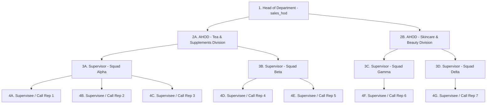
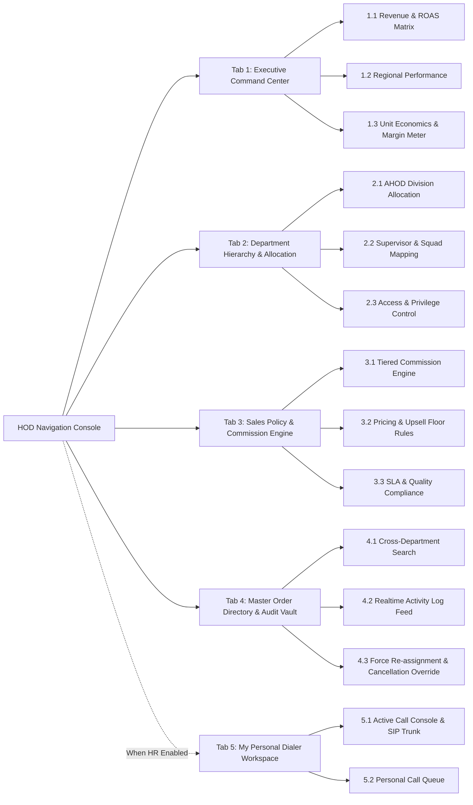
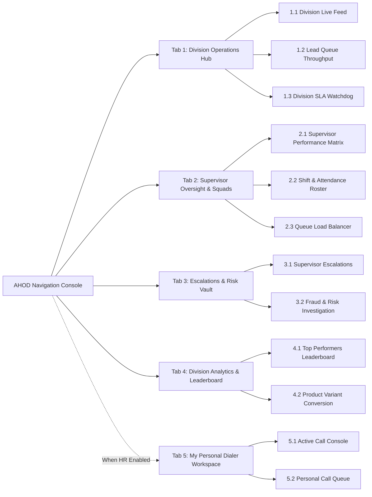
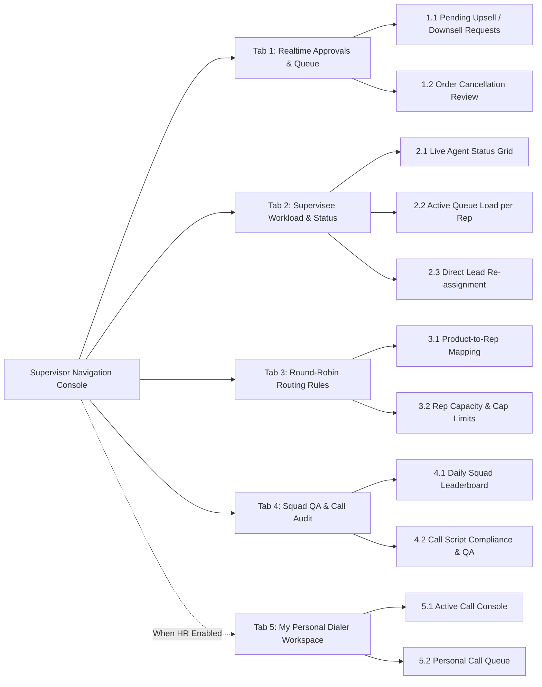
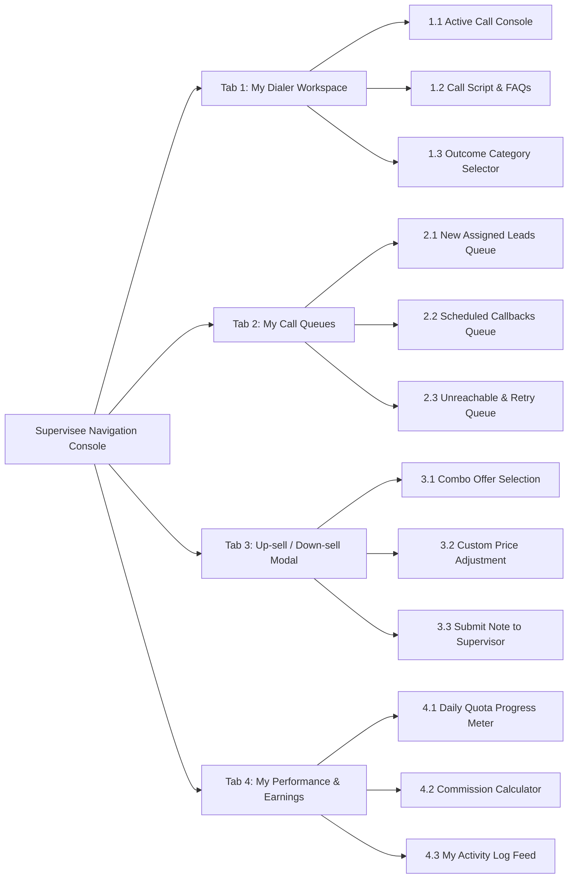
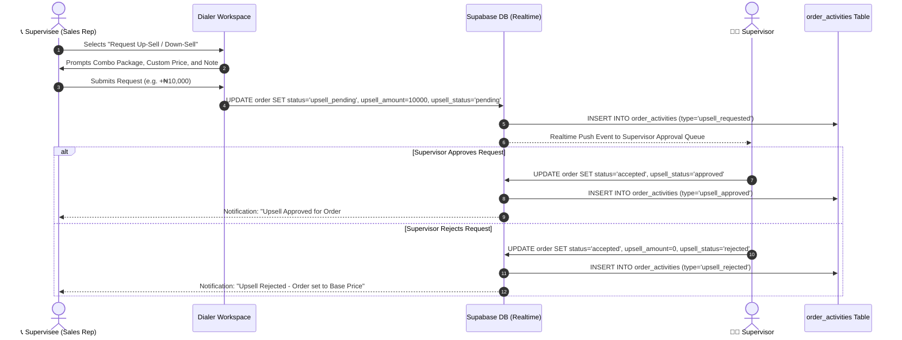
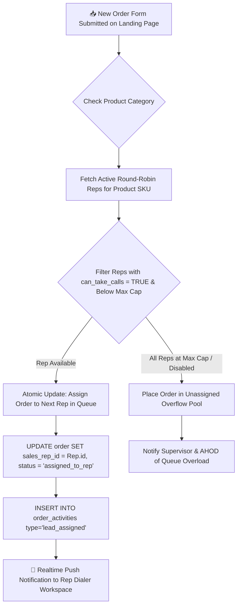
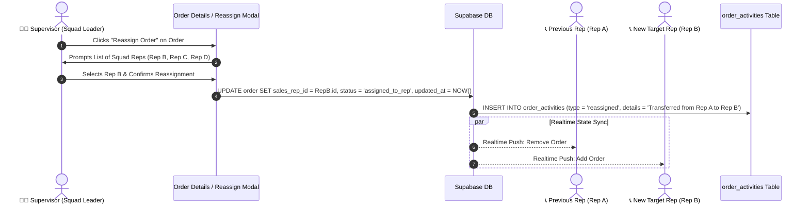
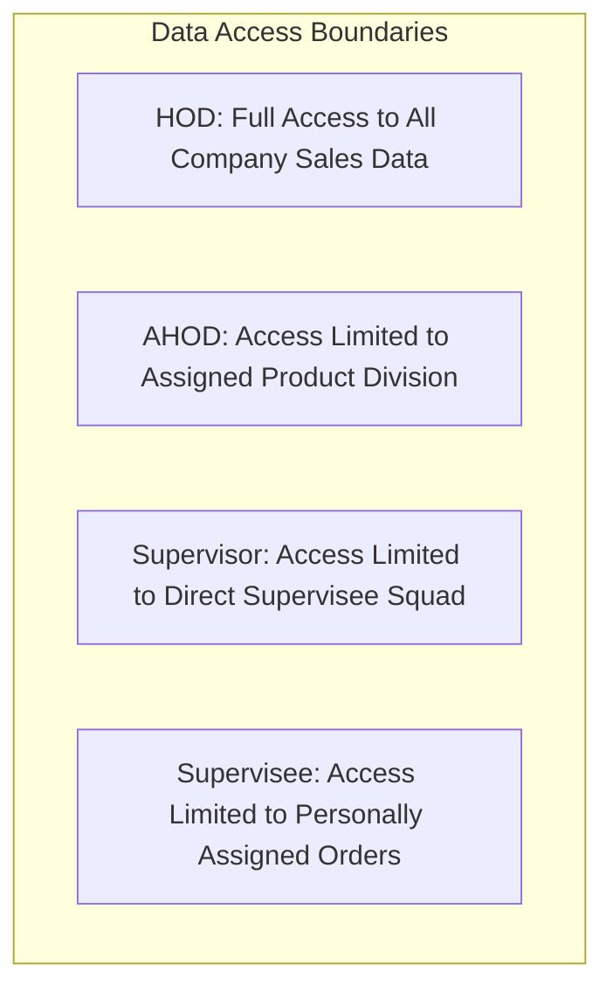
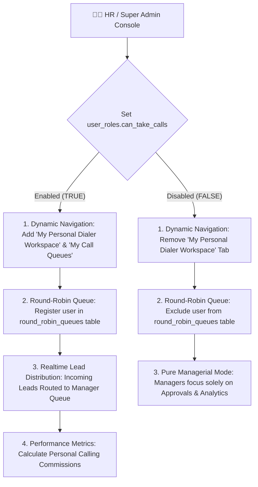

# NovaSuite Sales Department Hierarchy & Feature Specification

**Version:** 1.1.0  
**Module:** Sales Call Center & Revenue Management  
**Target Roles:** HOD (Head of Department) • AHOD (Assistant HOD) • Supervisor (Team Leader) • Supervisee (Sales Call Rep)  
**Backend Platform:** Supabase (PostgreSQL, Realtime, Row Level Security, Edge Functions)  

---

## 🏛️ 1. Sales Organizational Hierarchy Overview

NovaSuite structures the Sales Call Center into a strict 4-tier operational hierarchy to ensure clear chain of command, real-time lead routing, automated upsell authorization, and revenue auditability.

> [!NOTE]
> **Universal Call Rep Capability**: Every user across all hierarchy levels (HOD, AHOD, Supervisor, and Supervisee) possesses full frontline Call Rep operational capabilities (making calls, handling leads, scheduling callbacks, pitching up-sells). HR and Super Admins can dynamically enable or disable active dialer participation for any account via HR User Control (`can_take_calls`).



---

## 📑 2. Tab & Sub-Tab Feature Matrix by Role

---

### 👑 1️⃣ Head of Department (HOD) — Role: `sales_hod`
> **Primary Objective:** Nationwide sales revenue oversight, division budget & ROAS monitoring, commission policy enforcement, high-level squad structure management, and master activity audit.
> **Call Rep Mode (When HR `can_take_calls = true`):** Includes personal **"My Dialer Workspace"** and **"My Call Queues"** for direct customer calling.



#### Detailed Tab Specifications for HOD:

| Tab | Sub-Tab | Core Purpose & Feature Description | Operational Triggers & Actions |
| :--- | :--- | :--- | :--- |
| **1. Executive Command Center** | **1.1 Revenue & ROAS Matrix** | Real-time dashboard showing gross sales value, total cash collected (COD), lead conversion %, and ROAS per marketing channel (Meta, TikTok, Google). | • Filter by Today, Week, Month, Quarter.<br>• Export financial reports (CSV/PDF).<br>• View revenue vs ad spend comparison charts. |
| | **1.2 Regional Performance** | Breakdown of sales, order volume, and delivery success rates across states (Lagos, FCT Abuja, Rivers, Kano, Oyo). | • Drill down into specific state performance.<br>• Identify underperforming geographical zones. |
| | **1.3 Unit Economics & Margin Meter** | Monitors net profit margins per product line after deducting ad spend, telecommunication trunk fees (₦14.75/min), and delivery fulfillment fees. | • Set global cost alerts if product margin falls below target threshold (e.g. < 40%). |
| **2. Department Hierarchy & Allocation** | **2.1 AHOD Division Allocation** | Assign and re-assign AHODs to product lines or business units (e.g. AHOD John -> Herbal Tea Division). | • Drag-and-drop or select AHOD division assignment.<br>• View active division revenue metrics. |
| | **2.2 Supervisor & Squad Mapping** | Visual organogram of all Supervisors and their linked Call Reps. Reallocate entire squads between AHODs. | • Move Supervisor Squad from AHOD A to AHOD B.<br>• View team size and capacity load. |
| | **2.3 Access & Privilege Control** | Enforce security policies and override permissions for sales staff across the company. | • Toggle rep permissions (e.g. enable/disable manual lead claiming, enable force cancellation). |
| **3. Sales Policy & Commission Engine** | **3.1 Tiered Commission Engine** | Define base commission rate per confirmed order and tier bonuses for reps meeting daily quotas. | • Configure baseline commission (e.g. ₦500/accepted order).<br>• Set tier multiplier (e.g. >20 orders/day = ₦750/order). |
| | **3.2 Pricing & Upsell Floor Rules** | Set minimum upsell prices and maximum allowed downsell discounts to prevent reps from underselling products. | • Define Min Upsell Amount (e.g. ₦5,000 min).<br>• Define Max Downsell Discount (e.g. ₦3,000 max). |
| | **3.3 SLA & Quality Compliance** | Establish strict SLA timers for lead pick-up and callback execution. | • Set Max Initial Call Delay (e.g. 15 mins).<br>• Set Callback SLA (e.g. 30 mins window). |
| **4. Master Order Directory & Audit Vault** | **4.1 Cross-Department Search** | Global search across all orders in the database regardless of pipeline stage or assigned agent. | • Search by Order #, Customer Name, Phone, Delivery Address, or Rep Name.<br>• Multi-stage status filter. |
| | **4.2 Realtime Activity Log Feed** | Live activity stream displaying every status change, call log, callback reschedule, and upsell request nationwide. | • Real-time Supabase web-socket feed.<br>• Inspect individual activity details & timestamps. |
| | **4.3 Force Re-assignment & Override** | Emergency intervention console to reassign orders from inactive reps or force cancel fraudulent orders. | • 1-Click Force Reassign to specific Rep/Queue.<br>• Override status with HOD Audit Reason. |
| **5. My Personal Dialer Workspace** *(HR Enabled)* | **5.1 Active Call Console & SIP Trunk** | Frontline dialer interface enabling the HOD to call customers directly, pitch upsells, and close orders. | • Active 5-stage SIP call session.<br>• Select call outcomes & schedule callbacks. |
| | **5.2 Personal Call Queue** | Personal lead queue assigned to the HOD when participating in sales campaigns. | • View incoming assigned leads.<br>• Monitor personal callback countdowns. |

---

### 🛡️ 2️⃣ Assistant Head of Department (AHOD) — Role: `sales_ahod`
> **Primary Objective:** Division operational management, supervisor squad performance monitoring, handling escalated upsells/downsells, and queue load balancing.
> **Call Rep Mode (When HR `can_take_calls = true`):** Includes personal **"My Dialer Workspace"** and **"My Call Queues"**.



#### Detailed Tab Specifications for AHOD:

| Tab | Sub-Tab | Core Purpose & Feature Description | Operational Triggers & Actions |
| :--- | :--- | :--- | :--- |
| **1. Division Operations Hub** | **1.1 Division Live Feed** | Real-time monitoring feed of all leads entering the division's assigned product lines. | • Track lead inflow rate.<br>• Filter by assigned Supervisor squad. |
| | **1.2 Lead Queue Throughput** | Monitors uncalled lead backlog and active dialer processing speed across division squads. | • View percentage of leads dialed within 15 minutes.<br>• Alert when backlog exceeds threshold. |
| | **1.3 Division SLA Watchdog** | Flags leads sitting in `new` or `call_back` status beyond allowed SLA times. | • Highlight overdue callback orders.<br>• Auto-notify Supervisor responsible. |
| **2. Supervisor Oversight & Squads** | **2.1 Supervisor Performance Matrix** | Comparative analytics dashboard comparing squads managed by different Supervisors. | • Compare squad acceptance rate %, total revenue, average upsell amount, and supervisor approval turnaround time. |
| | **2.2 Shift & Attendance Roster** | Live roster showing which call reps are active, on break, in call, or offline across supervisor teams. | • View live agent connectivity status.<br>• Re-assign reps during shift changes. |
| | **2.3 Queue Load Balancer** | Mass lead transfer utility to balance workload between squads during traffic spikes. | • Select X number of uncalled leads from Squad A and transfer to Squad B. |
| **3. Escalations & Risk Vault** | **3.1 Supervisor Escalations** | Dedicated approval queue for requests that exceed Supervisor authorization limits (e.g. discounts > ₦5,000). | • 1-Click Approve/Reject high-value custom deals.<br>• Attach AHOD authorization notes. |
| | **3.2 Fraud & Risk Investigation** | Automated detection system flagging duplicate phone numbers, suspicious customer addresses, or rapid status cycling. | • Flag suspicious orders for investigation.<br>• Lock orders pending rep clarification. |
| **4. Division Analytics & Leaderboard** | **4.1 Top Performers Leaderboard** | Daily, weekly, and monthly rep rankings within the division based on confirmed revenue. | • View top 10 call reps.<br>• Award performance badges/bonuses. |
| | **4.2 Product Variant Conversion** | Analysis of conversion rates for different product bundles and upsell offers. | • Identify highest-converting product packages.<br>• Recommend script adjustments. |
| **5. My Personal Dialer Workspace** *(HR Enabled)* | **5.1 Active Call Console** | Personal calling console for AHODs participating in sales campaigns or taking overflow calls. | • Full 5-stage SIP call handling.<br>• Log call outcomes & schedule callbacks. |
| | **5.2 Personal Call Queue** | Queue of division leads assigned directly to the AHOD. | • View active assigned lead pool.<br>• Redial pending callbacks. |

---

### 👨‍💼 3️⃣ Department Supervisor — Role: `sales_supervisor`
> **Primary Objective:** Direct supervision of frontline call reps, real-time approval of pending upsells/downsells, round-robin lead routing configuration, and agent coaching.
> **Call Rep Mode (When HR `can_take_calls = true`):** Includes personal **"My Dialer Workspace"** and **"My Call Queues"**.



#### Detailed Tab Specifications for Supervisor:

| Tab | Sub-Tab | Core Purpose & Feature Description | Operational Triggers & Actions |
| :--- | :--- | :--- | :--- |
| **1. Realtime Approvals & Queue** | **1.1 Pending Upsell / Downsell Requests** | High-priority push notification queue containing rep upsell requests (`upsell_pending`). Shows Base Price, Requested Amount, Margin Delta, and Rep Notes. | • **1-Click Approve**: Updates order total, sets `upsell_status = approved`, moves order to `accepted` for logistics.<br>• **1-Click Reject**: Reverts price to base price, notifies rep. |
| | **1.2 Order Cancellation Review** | Review requests from reps to cancel orders (`cancelled`). Ensures reps attempted call-backs before closing leads. | • Approve cancellation.<br>• Reject cancellation & return order to rep queue with instructions. |
| **2. Supervisee Workload & Status** | **2.1 Live Agent Status Grid** | Visual cards for each supervisee showing status: `In Call (04:12)`, `Idle`, `On Call Back`, `On Break`, `Offline`. | • Monitor real-time rep activity.<br>• Ping rep if idle for extended duration. |
| | **2.2 Active Queue Load per Rep** | Meter showing how many active leads are currently held in each rep's dialer queue. | • View allocated vs uncalled leads per rep.<br>• Identify overloaded reps. |
| | **2.3 Direct Lead Re-assignment** | Select individual orders or lead batches and reassign them to a specific supervisee. | • Multi-select orders in directory.<br>• Reassign to Target Call Rep. |
| **3. Round-Robin Routing Rules** | **3.1 Product-to-Rep Mapping** | Matrix toggling which reps participate in round-robin distribution for specific product SKUs. | • Toggle rep ON/OFF for Herbal Tea, Booster, or Skincare queues. |
| | **3.2 Rep Capacity & Cap Limits** | Set maximum active lead cap per rep (e.g. 20 active leads) to prevent hoarding. | • Set Max Lead Cap.<br>• Auto-pause round-robin assignment when cap is reached. |
| **4. Squad QA & Call Audit** | **4.1 Daily Squad Leaderboard** | Daily scoreboard tracking calls made, accepted orders, confirmation rate %, and total COD revenue per supervisee. | • View real-time squad ranking.<br>• Monitor daily quota completion. |
| | **4.2 Call Script Compliance & QA** | Audit rep call outcome notes and activity logs for compliance with sales pitch guidelines. | • Review activity log timeline per rep.<br>• Leave coaching notes for rep. |
| **5. My Personal Dialer Workspace** *(HR Enabled)* | **5.1 Active Call Console** | Active calling interface allowing the Supervisor to make direct sales calls, pitch upsells, and log outcomes. | • Execute calls to assigned leads.<br>• Handle personal callbacks. |
| | **5.2 Personal Call Queue** | Personal dialer queue containing leads assigned to the Supervisor. | • View assigned lead pipeline.<br>• Manage personal callback schedule. |

---

### 📞 4️⃣ Supervisee / Sales Call Rep — Role: `sales_call_rep` (or `sales_supervisee`)
> **Primary Objective:** Execute calls to assigned customer leads, verify delivery details, pitch promotional up-sells/down-sells, schedule call-backs, and record call outcomes.

> [!IMPORTANT]
> **Strict Supervisee Lead Scoping Rules**:
> 1. **Assigned Lead Isolation**: Supervisees (`sales_call_rep`) **MUST ONLY SEE** leads explicitly assigned to them (`order.sales_rep_id == auth.uid()`).
> 2. **Cross-Rep Access Restrictions**: In both the dialer call queues and Order Directory, a Supervisee is strictly prohibited from viewing orders assigned to other reps.
> 3. **Re-assignment Transfer**: If a Supervisor reassigns an order from Rep A to Rep B, the order **immediately vanishes from Rep A's view** and **appears in Rep B's queue**.



#### Detailed Tab Specifications for Supervisee:

| Tab | Sub-Tab | Core Purpose & Feature Description | Operational Triggers & Actions |
| :--- | :--- | :--- | :--- |
| **1. My Dialer Workspace** | **1.1 Active Call Console** | Interactive 5-stage live call workspace with IT Sky SIP Trunk integration. Shows Customer Name, Phone, State, Address, Base Price, and Live Call Timer. | • 1-Click Start Call (Trunk Connect -> Ringing -> In Progress -> Call Ended -> Disconnected).<br>• Mute / Hold audio controls. |
| | **1.2 Call Script & FAQs** | Dynamic product pitch scripts tailored to the customer's ordered product SKU (Herbal Tea, Booster, Skincare). | • View objection handling guides.<br>• Copy standard WhatsApp follow-up messages. |
| | **1.3 Outcome Category Selector** | 4-Category outcome selector (`Confirm & Upsell`, `Reschedule Call`, `Unreachable`, `Closed / Recycle`). | • Select status outcome.<br>• Submit call notes & complete session. |
| **2. My Call Queues** | **2.1 New Assigned Leads Queue** | Incoming leads automatically routed to the rep via atomic round-robin. | • View customer name, phone, city, state, and product.<br>• Click-to-dial customer. |
| | **2.2 Scheduled Callbacks Queue** | Dedicated list of customer callbacks scheduled by the rep. Displays real-time live countdown timer (`01h 14m 30s` or `🚨 OVERDUE`). | • Sort by callback urgency.<br>• 1-Click Redial customer. |
| | **2.3 Unreachable & Retry Queue** | Leads flagged as `not_picking`, `switched_off`, or `not_reachable` requiring retry calls at different times of day. | • Track call attempt count (e.g. Attempt 2 of 3).<br>• Schedule retry call. |
| **3. Up-sell / Down-sell Modal** | **3.1 Combo Offer Selection** | Pitch pre-configured upsell package options (e.g. Buy 2 Get 1 Free, Extra Bottle add-on). | • Select upsell combo package.<br>• Auto-calculate new total amount. |
| | **3.2 Custom Price Adjustment** | Enter custom pricing or down-sell discount for price-sensitive customers. | • Enter custom price.<br>• Auto-check minimum allowed price floor. |
| | **3.3 Submit Note to Supervisor** | Input explanation note for Supervisor review (e.g. *"Customer agreed to add 1 extra bottle for ₦10,000"*). | • Click **Submit for Supervisor Approval** (`upsell_pending`). |
| **4. My Performance & Earnings** | **4.1 Daily Quota Progress Meter** | Visual progress bar tracking completed orders against rep's daily target (e.g. 18 / 25 confirmed orders). | • View target completion %.<br>• View daily confirmation rate %. |
| | **4.2 Commission Calculator** | Real-time estimate of total commission earned today and this month based on approved orders. | • View accrued commission balance.<br>• View tier bonus progress. |
| | **4.3 My Activity Log Feed** | Historical timeline of all calls, status updates, callbacks, and upsell requests logged by the rep today. | • Filter by activity type.<br>• Review customer call history. |

---

## 🔄 3. Key Operational Workflows & Sequence Diagrams

### 3.1 Order Upsell Approval Workflow
When a Supervisee requests an upsell or downsell discount, the order transitions to `upsell_pending` and triggers a real-time notification to their assigned Supervisor.



---

### 3.2 Atomic Round-Robin Lead Distribution Flow



---

### 3.3 Supervisor Lead Re-assignment & Queue Scoping Sequence



---

## 🗄️ 4. Database Schemas, Tables & Indexes

### 4.1 `user_roles` Table
Defines system access roles, chain-of-command hierarchy links, and **HR Dialer Toggles**.

```sql
CREATE TABLE public.user_roles (
    id UUID PRIMARY KEY DEFAULT gen_random_uuid(),
    user_id UUID NOT NULL REFERENCES auth.users(id) ON DELETE CASCADE,
    role VARCHAR(50) NOT NULL CHECK (role IN (
        'digital_marketer',
        'sales_call_rep',
        'sales_supervisor',
        'sales_ahod',
        'sales_hod',
        'logistics_call_rep',
        'delivery_agent',
        'finance_manager',
        'hr_manager',
        'general_manager',
        'super_admin'
    )),
    parent_user_id UUID REFERENCES auth.users(id) ON DELETE SET NULL, -- Supervisor ID for Rep, AHOD ID for Supervisor, HOD ID for AHOD
    division_id VARCHAR(100), -- Product Division (e.g. 'herbal_tea', 'vitality_booster', 'skincare')
    
    -- HR CONTROLS & DUAL-ROLE DIALER TOGGLES
    can_take_calls BOOLEAN NOT NULL DEFAULT true, -- Allows HOD/AHOD/Supervisor to participate in calling & round-robin
    is_active_call_rep BOOLEAN NOT NULL DEFAULT true, -- Dynamic HR toggle for active dialer status
    hr_notes TEXT, -- Administrative notes regarding dialer assignment status
    
    is_active BOOLEAN NOT NULL DEFAULT true,
    created_at TIMESTAMPTZ NOT NULL DEFAULT NOW(),
    updated_at TIMESTAMPTZ NOT NULL DEFAULT NOW()
);

-- Indexes for lightning-fast hierarchy & dialer availability lookups
CREATE INDEX idx_user_roles_user_id ON public.user_roles(user_id);
CREATE INDEX idx_user_roles_role ON public.user_roles(role);
CREATE INDEX idx_user_roles_parent ON public.user_roles(parent_user_id);
CREATE INDEX idx_user_roles_dialer ON public.user_roles(can_take_calls, is_active_call_rep) WHERE is_active = true;
```

---

### 4.2 `order_activities` Table
Tracks real-time order history, schedule timing, agent actions, and status updates.

```sql
CREATE TABLE public.order_activities (
    id UUID PRIMARY KEY DEFAULT gen_random_uuid(),
    order_id UUID NOT NULL REFERENCES public.orders(id) ON DELETE CASCADE,
    activity_type VARCHAR(50) NOT NULL CHECK (activity_type IN (
        'order_created',
        'lead_assigned',
        'status_update',
        'callback_scheduled',
        'logistics_assigned',
        'upsell_requested',
        'upsell_approved',
        'upsell_rejected',
        'reassigned',
        'cancelled'
    )),
    title VARCHAR(255) NOT NULL,
    details TEXT,
    performed_by UUID REFERENCES auth.users(id) ON DELETE SET NULL,
    user_role VARCHAR(50),
    scheduled_callback_at TIMESTAMPTZ,
    old_status VARCHAR(50),
    new_status VARCHAR(50),
    metadata JSONB DEFAULT '{}'::jsonb,
    created_at TIMESTAMPTZ NOT NULL DEFAULT NOW()
);

-- Index for real-time order timeline retrieval
CREATE INDEX idx_order_activities_order_created ON public.order_activities(order_id, created_at DESC);
```

---

### 4.3 `upsell_approval_requests` Table
Manages pending upsell/downsell authorization workflows between Supervisees and Supervisors.

```sql
CREATE TABLE public.upsell_approval_requests (
    id UUID PRIMARY KEY DEFAULT gen_random_uuid(),
    order_id UUID NOT NULL REFERENCES public.orders(id) ON DELETE CASCADE,
    rep_id UUID NOT NULL REFERENCES auth.users(id) ON DELETE CASCADE,
    supervisor_id UUID REFERENCES auth.users(id) ON DELETE SET NULL,
    base_price DECIMAL(12, 2) NOT NULL,
    requested_upsell_amount DECIMAL(12, 2) DEFAULT 0.00,
    requested_downsell_discount DECIMAL(12, 2) DEFAULT 0.00,
    new_total_amount DECIMAL(12, 2) NOT NULL,
    upsell_notes TEXT,
    supervisor_notes TEXT,
    status VARCHAR(50) NOT NULL DEFAULT 'pending' CHECK (status IN ('pending', 'approved', 'rejected')),
    created_at TIMESTAMPTZ NOT NULL DEFAULT NOW(),
    updated_at TIMESTAMPTZ NOT NULL DEFAULT NOW()
);

CREATE INDEX idx_upsell_requests_status ON public.upsell_approval_requests(status, created_at DESC);
CREATE INDEX idx_upsell_requests_supervisor ON public.upsell_approval_requests(supervisor_id);
```

---

### 4.4 `round_robin_queues` Table
Controls automatic lead assignment and capacity limits per call rep.

```sql
CREATE TABLE public.round_robin_queues (
    id UUID PRIMARY KEY DEFAULT gen_random_uuid(),
    product_id VARCHAR(100) NOT NULL,
    rep_id UUID NOT NULL REFERENCES auth.users(id) ON DELETE CASCADE,
    supervisor_id UUID REFERENCES auth.users(id) ON DELETE SET NULL,
    is_active BOOLEAN NOT NULL DEFAULT true,
    max_capacity INT NOT NULL DEFAULT 25,
    current_load INT NOT NULL DEFAULT 0,
    last_assigned_at TIMESTAMPTZ DEFAULT NOW(),
    created_at TIMESTAMPTZ NOT NULL DEFAULT NOW(),
    CONSTRAINT unique_product_rep UNIQUE (product_id, rep_id)
);

CREATE INDEX idx_round_robin_product_active ON public.round_robin_queues(product_id, is_active, last_assigned_at ASC);
```

---

### 4.5 `sales_target_quotas` Table
Stores daily/monthly quotas and commission structures for sales staff.

```sql
CREATE TABLE public.sales_target_quotas (
    id UUID PRIMARY KEY DEFAULT gen_random_uuid(),
    user_id UUID NOT NULL REFERENCES auth.users(id) ON DELETE CASCADE,
    role VARCHAR(50) NOT NULL,
    daily_target_orders INT NOT NULL DEFAULT 20,
    monthly_revenue_target DECIMAL(12, 2) NOT NULL DEFAULT 5000000.00,
    base_commission_per_order DECIMAL(10, 2) NOT NULL DEFAULT 500.00,
    tier_bonus_threshold INT DEFAULT 25,
    tier_bonus_commission DECIMAL(10, 2) DEFAULT 750.00,
    effective_date DATE NOT NULL DEFAULT CURRENT_DATE,
    created_at TIMESTAMPTZ NOT NULL DEFAULT NOW()
);

CREATE INDEX idx_sales_quotas_user ON public.sales_target_quotas(user_id, effective_date);
```

---

## 🔒 5. Row Level Security (RLS) & Access Scope Matrix

To guarantee strict data isolation between teams, Supabase Row Level Security policies enforce the following data access boundaries:



| Role | Read Access Scope | Write / Update Scope | Approval Privileges |
| :--- | :--- | :--- | :--- |
| **HOD (`sales_hod`)** | Full read access to all nationwide orders, call logs, revenue metrics, and activity timelines. | Can update any order status, force reassign orders, modify global commission rules, and override sales policies. | Can approve any pending upsell, downsell, or cancellation request across all divisions. |
| **AHOD (`sales_ahod`)** | Read access to all orders and squad metrics within their assigned Product Division. | Can reassign orders between supervisor queues in their division, update division lead settings, and adjust division rosters. | Can approve escalated upsell/downsell requests exceeding supervisor limits. |
| **Supervisor (`sales_supervisor`)** | Read access to all orders and call activities of their direct supervisee squad (`parent_user_id == supervisor.id`). | Can reassign leads between squad supervisees via 1-Click Reassignment console, update round-robin rep caps, and leave coaching audit notes. | Can approve or reject pending upsell requests (`upsell_pending`) and review order cancellations. |
| **Supervisee (`sales_call_rep`)** | **STRICT ISOLATION**: Read access limited strictly to orders assigned directly to their `sales_rep_id`. Cannot view orders of other reps. | Can update order status (`accepted`, `call_back`, `not_picking`, `cancelled`), add call notes, and schedule callbacks for their assigned leads. | Cannot approve upsells or reassign leads; must request supervisor authorization. |

---

## 🎛️ 6. HR Controlled Active Dialer Toggles & Dynamic UI Rendering

NovaSuite enables HR and Super Admins to dynamically control whether managers participate in frontline calling.



### HR Toggle Rules:
1. **Default State**: Supervisees (`sales_call_rep`) have `can_take_calls = true` locked.
2. **Managerial State**: For HODs, AHODs, and Supervisors, `can_take_calls` defaults to `true` but can be toggled to `false` by HR.
3. **Dynamic Navigation**: When `can_take_calls = true`, the UI dynamically injects the frontline dialer workspace and queue tab into the manager's header menu.
4. **Lead Routing Isolation**: When `can_take_calls = false`, the automated round-robin lead allocation algorithm skips the manager's ID, ensuring leads are routed exclusively to active frontline supervisees.

---

## 🎨 7. Summary of Architectural Alignment

This updated specification provides a complete blueprint for the **Sales Rep (HOD - AHOD - Supervisor - Supervisee)** accounts in NovaSuite CRM:
1. **Universal Call Capability**: All hierarchy levels inherit frontline call rep features.
2. **HR Controlled Toggles**: `can_take_calls` controls active dialer participation and dynamic UI navigation.
3. **Clear Chain of Command**: 4 distinct operational tiers with dedicated tabs, sub-tabs, and approval thresholds.
4. **Database Integrity**: PostgreSQL schemas, indexes, real-time activity logs, and RLS security policies.
5. **Visual Workflow Models**: Mermaid sequence, flowchart, organogram, and RLS boundary diagrams.
