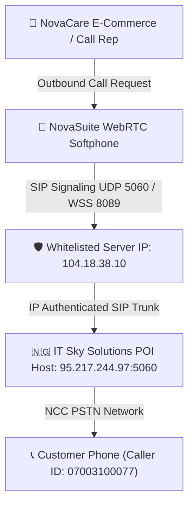
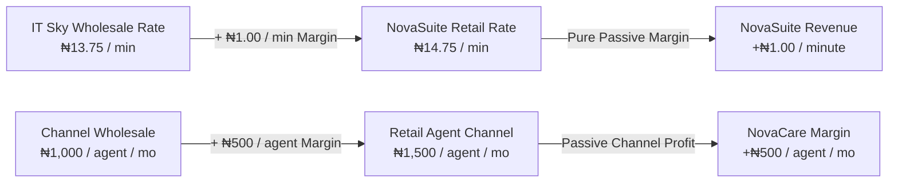
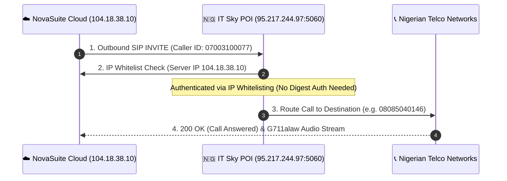
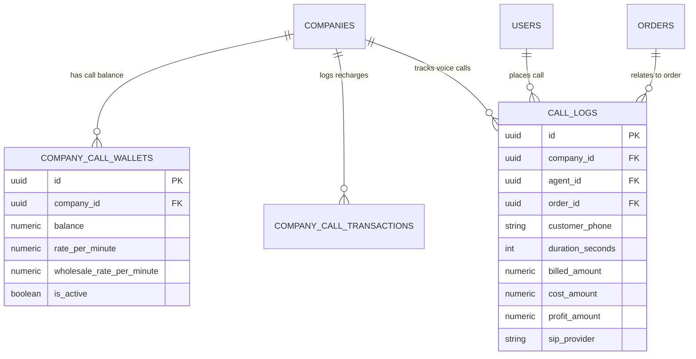
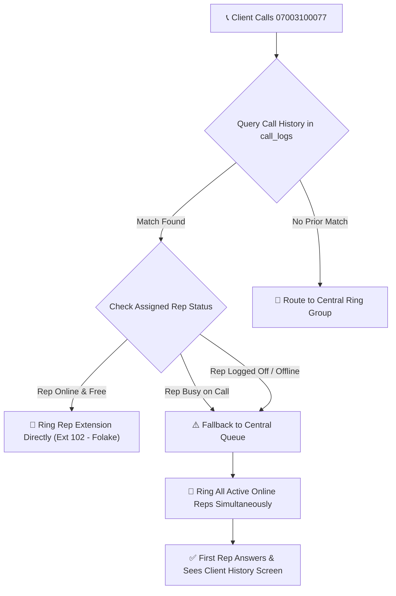

# 🇳🇬 Telecom-as-a-Service (TaaS) & IT Sky SIP Interconnect Guide

## Executive Overview
NovaSuite incorporates an integrated WebRTC softphone and SIP trunking engine powered by **IT Sky Solutions (Abuja Interconnect POI)**. This enables D2C brands, pharmaceutical distributors, and e-commerce companies across Nigeria to make outbound customer confirmation calls directly inside NovaSuite while establishing a highly profitable **B2B Telecom Reseller** model (+₦1.00/min passive profit for NovaSuite).



---

## 📊 1. Commercial & Pricing Model



### NovaCare Real-World Financial Example (200 Sales Reps):
- **Old Mobile SIM Spend**: 200 reps $\times$ ₦11,000 avg = **₦2,200,000 / month**
- **New NovaSuite SIP Line Spend**: ~88,000 minutes + 200 channels = **₦1,498,000 / month**
- 💵 **Net Savings for NovaCare**: **₦702,000 / month** *(₦8.4 Million Saved Yearly!)*
- 💵 **NovaSuite Passive Revenue**: **+₦88,000+ / month** on the ₦1.00/min margin.

---

## ⚙️ 2. IT Sky Solutions Interconnect Exchange Parameters



### 📤 A. Information You Provide to IT Sky Solutions:
| Parameter | Setting / Value | Purpose |
| :--- | :--- | :--- |
| **Your Public IP Address** | `104.18.38.10` (Server Public IP) | Whitelisted by IT Sky for SIP IP authentication & firewall access |
| **Your SIP Port** | `5060` (UDP) / `8089` (WSS WebSockets) | Port on which your PBX / WebRTC gateway listens for incoming signaling |

---

### 📥 B. Information IT Sky Solutions Provides to You:
| Parameter | Setting / Value | Purpose |
| :--- | :--- | :--- |
| **SIP Server Host** | `95.217.244.97` (No port specified) | IT Sky Solutions target ASTPP PBX Host |
| **SIP Domain / Realm** | `07003100077.astpp.itskysolutions.com` | ASTPP Customer SIP Domain |
| **Username** | `07003100077` | SIP Account Digest Authentication Username |
| **Password** | `C)Jz2(yC` | SIP Digest Secret Key |
| **Assigned DID Number** | `07003100077` | Official Direct Inward Dialing number for caller ID & callbacks |
| **SIP Authentication Mode** | **MD5 Digest Authentication + IP Whitelist** | Username, Password & Realm challenge verification |
| **Transport Protocol** | `UDP` (Native PJSIP) / `WSS` (WebRTC WebSockets) | Real-time signaling transport |
| **Register Refresh / Keep-Alive**| `300s` Refresh • `15s` Keep-Alive | Session persistence & NAT traversal parameters |
| **Supported Voice Codecs** | `G711alaw` (PCMA), `G711ulaw`, `G.729` | HD Voice audio codecs |
| **Key Account Contacts** | **Muhammad** (`09160331333`)<br>**Maryann** (`08133355766`)<br>**Abubakar** (`09065655211`) | IT Sky Solutions Technical Support Team |

---

## 🗄️ 3. Supabase Billing Schema (`company_call_wallets`)



```sql
CREATE TABLE public.company_call_wallets (
  id UUID PRIMARY KEY DEFAULT gen_random_uuid(),
  company_id UUID NOT NULL REFERENCES public.companies(id) ON DELETE CASCADE,
  balance NUMERIC(12, 2) NOT NULL DEFAULT 0.00,
  rate_per_minute NUMERIC(6, 2) NOT NULL DEFAULT 14.75,
  wholesale_rate_per_minute NUMERIC(6, 2) NOT NULL DEFAULT 13.75,
  low_balance_threshold NUMERIC(12, 2) NOT NULL DEFAULT 5000.00,
  is_active BOOLEAN NOT NULL DEFAULT true,
  created_at TIMESTAMPTZ NOT NULL DEFAULT now(),
  updated_at TIMESTAMPTZ NOT NULL DEFAULT now()
);

CREATE TABLE public.company_call_transactions (
  id UUID PRIMARY KEY DEFAULT gen_random_uuid(),
  company_id UUID NOT NULL REFERENCES public.companies(id) ON DELETE CASCADE,
  amount NUMERIC(12, 2) NOT NULL,
  transaction_type VARCHAR(50) NOT NULL DEFAULT 'RECHARGE',
  payment_reference VARCHAR(100),
  description TEXT,
  created_at TIMESTAMPTZ NOT NULL DEFAULT now()
);

CREATE TABLE public.call_logs (
  id UUID PRIMARY KEY DEFAULT gen_random_uuid(),
  company_id UUID NOT NULL REFERENCES public.companies(id) ON DELETE CASCADE,
  agent_id UUID NOT NULL REFERENCES public.users(id) ON DELETE CASCADE,
  order_id UUID REFERENCES public.orders(id) ON DELETE SET NULL,
  customer_phone VARCHAR(50) NOT NULL,
  duration_seconds INT NOT NULL DEFAULT 0,
  billed_amount NUMERIC(10, 2) NOT NULL DEFAULT 0.00,
  cost_amount NUMERIC(10, 2) NOT NULL DEFAULT 0.00,
  profit_amount NUMERIC(10, 2) NOT NULL DEFAULT 0.00,
  sip_provider VARCHAR(100) NOT NULL DEFAULT 'IT Sky Solutions',
  call_status VARCHAR(50) NOT NULL DEFAULT 'ANSWERED',
  created_at TIMESTAMPTZ NOT NULL DEFAULT now()
);
```

---

## 🖥️ 4. Rep Softphone Configuration (MicroSIP & NovaDialer)

### MicroSIP Setup on Sales Rep Laptops:
- **SIP Server / Proxy**: `95.217.244.97:5060`
- **Domain**: `95.217.244.97`
- **Caller ID / DID**: `07003100077`
- **Auth Mode**: IP Whitelisting (No Password required)

### WebRTC Softphone inside NovaSuite:
- Click **`NovaDialer`** in the bottom-right corner.
- Click ⚙️ **SIP Settings** $\rightarrow$ verifies **`🇳🇬 IT Sky Solutions (95.217.244.97:5060)`** with DID **`07003100077`**.
- Click **`Start Call`** on any order row in the Live Call Queue DataTable to place 1-tap calls!

---

## 🔄 5. Inbound Callback Routing & Central Line Fallback Architecture



### Operational Rules:
1. **Primary Routing (Sticky Agent)**:
   - When a client calls back the central company line (`07003100077`), NovaSuite queries recent `call_logs` for that customer's phone number.
   - If the assigned rep is **Online & Available**, the call rings directly on their extension.

2. **Automated Fallback to Central Call Queue**:
   - If the assigned rep is **Busy** (on another active call) or **Logged Off / Offline**:
     - The call instantly falls back to the **Central Ring Group / Central Queue** where all active online reps receive the incoming ring!
     - Whichever available rep answers the central line gets an instant pop-up of the client's order history (`#ORD-2026-8901`), customer name, and previous rep's notes so they can complete the confirmation without friction.
