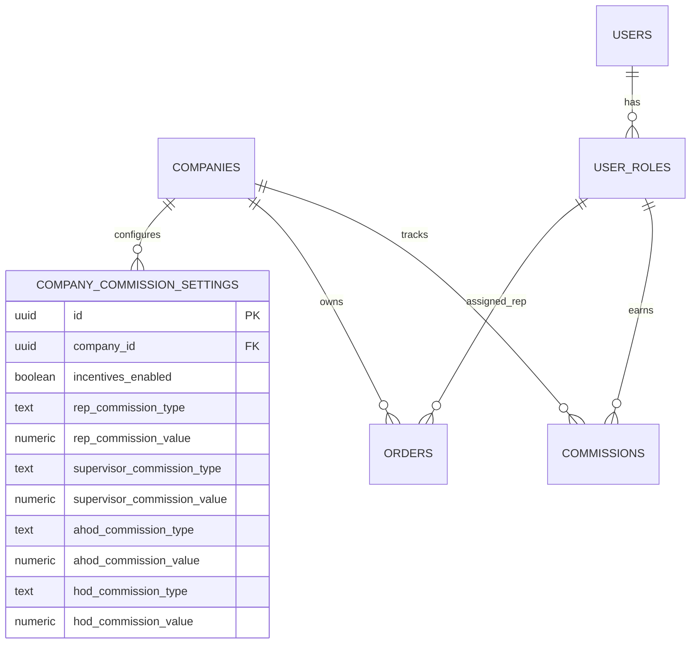

# 🚀 NOVASUITE PROJECT CONTEXT & ARCHITECTURE HIGHLIGHTS

> **Purpose**: Complete context handoff document summarizing the architectural decisions, database schemas, feature implementations, domain rules, and current state for seamless context transfer.

---

## 📌 1. Project Overview & Repository Structure

- **Repository Root**: `c:\PROJECT\novasuite`
- **GitHub Remote**: `https://github.com/odufu/NovaSuit.git` (`main` branch)
- **Monorepo Architecture**:
  - `packages/novasuite_core`: Shared models, repositories, theme tokens, Supabase client configuration, SIP VoIP telephony engine.
  - `apps/novasuite_admin`: Flutter web/mobile/desktop admin application using Feature-First Clean Architecture.
  - `supabase/`: SQL migrations (`supabase/migrations/`) and Deno/TypeScript Edge Functions (`supabase/functions/`).

---

## ⚙️ 2. Core Domain Rules & Business Logic

1. **Call Rep Financial Isolation & Performance Focus**:
   - **Call Reps NEVER see company financial figures** (e.g. Total COD Revenue, sales order prices, company gross revenue, product cost prices).
   - Call Rep metrics are strictly performance and personal incentive commission-based (**`My Commission Earned`**).
   - Trend Chart title on Call Rep view updated from `Weekly Revenue` ➔ **`📈 Weekly Commission & Call Volume Trends`**.
2. **Operations / GM Multi-Tier Commission System**:
   - Commissions can be calculated via:
     - `fixed_per_unit`: Monetary value per delivered product (e.g., ₦1,000 / unit).
     - `percentage`: Percentage of delivered order value (e.g., 5.0% of order total).
   - Supports 4 organizational hierarchy roles:
     1. **Sales Call Rep**
     2. **Team Leader (Supervisor)**
     3. **Assistant Head of Department (AHOD)**
     4. **Head of Department (HOD)**
   - **Operations Master Toggle**: Operations / GM Department can enable (`TRUE`) or disable (`FALSE`) incentive commissions globally or per product.
3. **Daily Operational Report Standards (Monday 27th July, 2026 Baseline)**:
   - **35 Total Assigned**
   - **21 Confirmed**
   - **17 Delivered** (6 yet to be tagged on CRM)
   - **15 Delivered Today / 2 Previous Days**
   - **7 Rescheduled**
   - **6 In Progress**
   - **2 Switched Off**
   - **4 Not Picking / Unanswered**
   - **0 Cancelled**
   - **1 Not Ready / Pending**

---

## 🗄️ 3. Database Schema & Migration Log

| Migration File | Key Tables & Changes |
| :--- | :--- |
| `20260731000000_seed_supervisor_squad_report_data.sql` | Adds `crm_tagged` (BOOLEAN) to `orders`, `assigned_products` (TEXT[]) to `user_roles`, and seeds the 35 July 27 operational report orders into Supabase. |
| `20260731000001_add_commissions_system.sql` | Adds `commissions` ledger table, product commission rates, and trigger for automated commission calculation. |
| `20260801000000_add_multi_tier_commission_settings.sql` | Creates `company_commission_settings` table for Operations/GM configuration (Fixed/Percentage for Rep, Supervisor, AHOD, HOD), adds `ahod_id` & `hod_id` to `user_roles`, and updates `process_order_delivered_commissions()` trigger. |

---

## 💻 4. Key UI Features & Component Reference

### 1. Call Rep Performance Dashboard (`main.dart`)
- Revenue statistics hidden.
- Metrics display: **`My Call Queue`**, **`My Commission Earned (₦17,000)`**, **`Upsells Pending Approval`**, **`My Conversion Rate (78.4%)`**.
- Trend Chart: **`📈 Weekly Commission & Call Volume Trends`** (`₦123k Commission`).

### 2. Collapsible Left Side Navigation (`AdminMainShell` in `main.dart`)
- Width: `74px` (collapsed) ↔ `260px` (expanded).
- Sidebar entries under `SUPERVISOR COMMAND SUITE`:
  - `Team Performance KPIs` (Dashboard Overview in squad context)
  - `Operational Daily Report`
  - `Realtime Upsell Approvals`
  - `1-Click Lead Reassignment`
  - `Manage Supervisees`
  - `My Personal Dialer Queue`

### 3. Agent Profile Modal (`AgentProfileModal`)
- Shows **Commission Earned** instead of company COD Revenue for Call Reps.
- Product license switches, lead capacity sliders, and auto round-robin toggles.

---

## 🧪 5. Verification & Code Quality Status

- `flutter analyze packages/novasuite_core`: **`No issues found!` (0 errors, 0 warnings)**
- `flutter analyze apps/novasuite_admin`: **`No issues found!` (0 errors, 0 warnings)**
- All changes committed to local repository (`main` branch).
